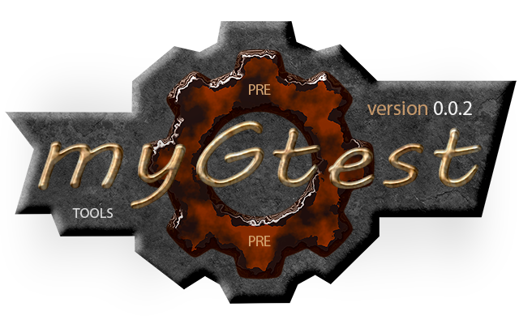

[](../README.md)  

[M]: #main        "головной файл документации"
[H]: ../README.md        "на главную"
[P]: icons/progress.png  "в процессе..."
[S]: icons/success.png   "ошибок не обнаружено"
[GTest]: https://github.com/google/googletest
    
<a name="main"></a>
[![S]][H] Документация v0.0.1
=============================
Расширение для [GTest].  
Предоставляет ряд удобных возможностей для организации юнит-тестов:  
  - мутекс с поддержкой старых компиляторов  
  - более сложные имена для тестов  
  - списки компиляции юнит-тестов  
<br/>

Имена тестов
------------
В оригинальном [GTest] имена тестов состоят из двух слов, разделенных точкой:  

```
#include <gtest/gtest.h>

struct some
{
    bool foo() { return true; }
};

TEST(some, foo)
{
    some obj;
    ASSERT_TRUE(obj.foo());
}
```

Вывод в консоль:  

```
[==========] Running 1 test from 1 test suite.
[----------] Global test environment set-up.
[----------] 1 test from tools
[ RUN      ] some.foo
[       OK ] some.foo (22 ms)
```

Однако на практике часто этого бывает недостаточно.  
Например, у нас есть несколько классов с одинаковыми именами, но с различными `namespace`.  
И вот, чтобы было понятно к какому именно классу относится тот или иной тест,  
хочется включить `namespace` класса в название теста.  
Для этой цели и было разработанно расширение `mygtest`.  

Расширение `mygtest` позволяет использовать следующий дизайн:  

```
#include <mygtest/modern.hpp>

#ifdef TEST_MODERN
#define dTEST_COMPONENT Namespace, Class
#define dTEST_METHOD Method
#define dTEST_TAG tdd

#icnlude <cassert>
void foo()
{
    assert(false);
}

TEST_COMPONENT(000)
{
    ASSERT_DEATH_DEBUG(foo());
}

#endif // TEST_MODERN
```

Вывод в консоль:  

```
[==========] Running 1 test from 1 test suite.
[----------] Global test environment set-up.
[----------] 1 test from example\additional
[ RUN      ] Namespace\Class.Method_000(tdd)
[       OK ] Namespace\Class.Method_000(tdd) (0 ms)
[----------] 1 test from Namespace\Class (0 ms total)
```

Данное расширение позволяет:  
  - через запятую указать до пяти (включительно) имен.  
  - указатель тестируемый метод.  
  - указать тэг (аспект тестируемой ситуации).  
  - а для конкретных тестов указать порядковый номер  

Такой подход удобен тем, что не нужно каждый раз придумывать названия для тестов.  
Все тесты из одного файла различаются только порядковым, при помощи которого
можно быстро и точно идентифицировать сбойные тесты.  

А ещё, если указать символ подчеркивания в начале имени макроса:  
```cpp
_TEST_COMPONENT(001)
{
    ASSERT_DEATH_DEBUG(foo());
}
```

Тогда тест будет проигнорирован gtest.  
Таким образом удобно отключать ненужные тесты.  
<br/>

Списки компиляции юнит-тестов
-----------------------------
Расширение `mygtest` предполагает следующее строение:  
```bat
test
 |--- include
 |     |--- test-develop.hpp
 |      `-- test-stable.hpp
  `-- sources
        `-- test-modern.cpp
```

Где, файлы `test-develop.hpp` и `test-stable.hpp` содержат списки юнит-тестов  
Например:  

```cpp
#pragma once
// пример содержимого файла test-develop.hpp

// перечисляем тесты, которые нужно включить в сборку
#define TEST_MODERN  
#define TEST_CLASSIC 
```

А исходный код тестов (`test-modern.cpp`) имеет вид:  

```cpp
#include <mygtest/modern.hpp>

#ifdef TEST_MODERN
#define dTEST_COMPONENT Namespace, Class
#define dTEST_METHOD Method
#define dTEST_TAG tdd

#include "staff.hpp"

TEST_COMPONENT(000)
{
    someTest();
}

#endif // TEST_MODERN
```

Запуск `mygtest/modern.hpp` подключает всё необходимое для работы mygtest,  
а так же, в зависимости от макроса `STABLE_RELEASE` подключает:  

```cpp
#ifdef STABLE_RELEASE
    #include "test-stable.hpp"
#else
    #include "test-develop.hpp"    
#endif
```
Таким образом контролируется: какие тесты войдут или не войдут в сборку.  
<br/>


Мутекс
------
В языке с++ стандартные мутексы появились начиная с с++11  
А для старых компиляторов нужно велосипедить что-то своё  
Расширение mygtet позволяет использовать `mygtest::synch`  
Который для новых компиляторов использует `std::recursive_mutex`  
А для древних компиляторов используется кросс-платформенный велосипед  
<br/>

--------------------------------------------------------------------------------

[Хронология](chrono.md)  
[История](history.md)  

