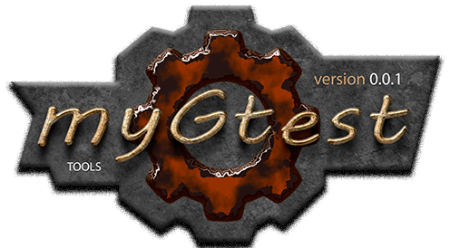

 

[P]: icons/progress.png  "в процессе..."
[S]: icons/success.png   "ошибок не обнаружено"
[F]: icons/failed.png    "была выявлена ошибка"
[D]: icons/danger.png    "дефекты, недоработки, некритичные баги"
[E]: icons/empty.png     "нет данных"
[B]: icons/bug.png       "обнаружен баг"
[N]: icons/na.png        "функциональность не доступна"

[![P]][M] MyGTest v0.0.1 
========================

Публичное API:  

| **ID** |     элементы    |   mingw    |   mingw    |    mingw   |    mingw    |   mingw     |    msvc    |    msvc    |  
|:------:|:---------------:|:----------:|:----------:|:----------:|:-----------:|:-----------:|:----------:|:----------:|  
|        |                 |   810 730  |  640 630   |   540 530  | 494 493 492 | 485 484 483 | 2019 2017  |  2013 2012 |  
|        |                 |   720 710  |  620 610   |   520 510  |   491 490   |   482 481   |   2015     |  2010 2008 |  
|  0000  | [mygtest][00]   | [![S]][00] | [![S]][00] | [![S]][00] | [![S]][00]  | [![S]][00]  | [![S]][00] | [![S]][00] |  
|  0001  | [main][01]      | [![S]][01] | [![S]][01] | [![S]][01] | [![S]][01]  | [![S]][01]  | [![S]][01] | [![S]][01] |  
|  0002  | [test-list][02] | [![S]][02] | [![S]][02] | [![S]][02] | [![S]][02]  | [![S]][02]  | [![S]][02] | [![S]][02] |  
|  0003  | [modern][03]    | [![S]][03] | [![S]][03] | [![S]][03] | [![S]][03]  | [![S]][03]  | [![S]][03] | [![S]][03] |  
|  0004  | [dprint][04]    | [![S]][04] | [![S]][04] | [![S]][04] | [![S]][04]  | [![S]][04]  | [![S]][04] | [![S]][04] |  

Детали реализации:  

| **ID** |    элементы     |   mingw    |   mingw    |    mingw   |    mingw    |   mingw     |    msvc    |    msvc    |  
|:------:|:---------------:|:----------:|:----------:|:----------:|:-----------:|:-----------:|:----------:|:----------:|  
|        |                 |   810 730  |  640 630   |   540 530  | 494 493 492 | 485 484 483 | 2019 2017  |  2013 2012 |  
|        |                 |   720 710  |  620 610   |   520 510  |   491 490   |   482 481   |   2015     |  2010 2008 |  
|  0005  | [synch][05]     | [![S]][05] | [![S]][05] | [![S]][05] | [![S]][05]  | [![S]][05]  | [![S]][05] | [![S]][05] |  
|  0006  | [features][06]  | [![S]][06] | [![S]][06] | [![S]][06] | [![S]][06]  | [![S]][06]  | [![S]][06] | [![S]][06] |  

 

[M]: #main  "определяет технические возможности компилятора"
[MINGW]:  #main  "поддержка компиляторов mingw"
[VS-NEW]: #main  "поддержка новых компиляторов msvc"
[VS-OLD]: #main  "поддержка старых компиляторов msvc"

[00]: code/mygtest.md           "главный заголовок модуля"
[01]: code/main.md              "оформлением main.cpp"
[02]: code/test-list.md         "стиль:  классика"
[03]: code/modern.md            "стиль: модерн"
[04]: code/dprint.md            "вывод в std::cout"
[05]: code/private/synch.md     "мьютекс"
[06]: code/private/features.md  "возможности компилятора"

---------------------------------------

1) [История](history.md)  

